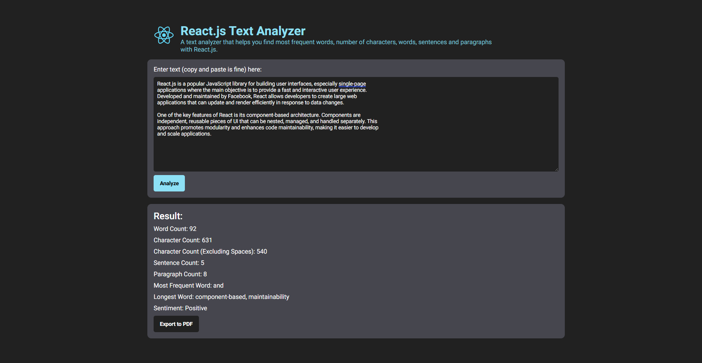

# react-text

"react-text" is a word analysis tool built with React. It is designed to help users analyze the frequency of words, word counts,characters, paragraphs, and sentences in a given text. The tool also provides a word sentiment analysis feature and allows the report to be downloaded as a PDF file.

## Tech stack

- React
- HTML and CSS

## Install with Docker

```bash
docker-compose up --build
```

Then open [http://localhost:80](http://localhost:80) to see the app.

## Problem and Thought Process

Although I am familiar with these tech stacks, I still bumped into the walls and stucked once in a while. Here are some of the problems I encountered and how I solved them.

### Problem 1: How do I get dot-separated words to count as one word?

To ensure that dot-separated words and hyphenated words are counted as single words, I created a helper function called `normalizeText`. This function uses regular expressions to handle various cases:

- Removing Punctuation: It removes punctuation marks when they are surrounded by spaces. For instance, it will convert "react-text" to "reacttext" and "U.S.A" to "USA".
- Handling Sentence Endings: It accounts for dot-separated words at the end of sentences by removing any trailing punctuation if it is preceded or followed by a space.
- Removing Digits: To focus solely on English words, the function also removes any digits from the text.

Here's the implementation:

```javascript
function normalizeText(text) {
  return text
    .replace(/(\s[^\w\s]|[^\w\s]\s)/g, " ") // Remove punctuation if it is preceded or followed by a space
    .replace(/[^\w\s]$/g, "") // Remove punctuation at the end of the string
    .replace(/\d+/g, "") // Remove digits
    .replace(/\s+/g, " ") // Replace multiple spaces with a single space
    .trim(); // Remove leading and trailing spaces
}
```

To ensure that normalizeText functions correctly, I wrote test cases to validate its behavior:

```javascript
describe("normalizeText", () => {
  test("should remove punctuation, digits, and extra spaces", () => {
    expect(normalizeText("Hello, World! This is a test: 12345.")).toBe(
      "Hello World This is a test",
    );
  });

  test("should ignore multiple spaces", () => {
    expect(normalizeText("  Hello  World!  ")).toBe("Hello World");
  });
});
```

### Problem 2: How do I start counting words?

To count the number of words in a given text, I created a helper function called `wordCount`. This function processes the text to provide an accurate word count.

The wordCount function performs the following steps:

- Trim Whitespace: It removes any leading or trailing spaces from the text.
- Split and Filter: The function splits the text by spaces and removes any empty strings to ensure that only actual words are counted.

```javascript
export function wordCount(text) {
  // Split the text by spaces and filter out any empty strings
  const words = text.trim().split(/\s+/).filter(Boolean);
  return words.length;
}
```

I wrote another test cases for this function to check if the function returns the correct result. This time, I used normalizedText function to assert my assumption.

```javascript
describe("wordCount", () => {
  test("should return 0 for an empty string", () => {
    const text = "";

    const normalizedText = normalizeText(text);

    expect(wordCount(normalizedText)).toBe(0);
  });

  test("should count words in a string with single words", () => {
    const text = "hello";

    const normalizedText = normalizeText(text);

    expect(wordCount(normalizedText)).toBe(1);
  });

  test("should count words in a string with multiple words", () => {
    const text = "hello world";

    const normalizedText = normalizeText(text);

    expect(wordCount(normalizedText)).toBe(2);
  });
});
```

### Problem 3: How do I count Most Frequent Word and Longest Word?

To determine the most frequent word and the longest word in a given text, I created two helper functions: mostFrequentWord and longestWord. Both functions use similar approaches to process the text and produce results.

The `mostFrequentWord` function calculates the frequency of each word in the text and identifies the word(s) with the highest frequency. It uses a map to track word counts and the reduce function to determine the most frequent word(s).

The `longestWord` function identifies the longest word(s) in the text. It uses the reduce function to find the maximum length and then filters the words that match this length.

Here are the implementations of these functions:

```javascript
function mostFrequentWord(text) {
  const textArray = text.split(" ");

  // Calculate word frequencies and determine the maximum frequency
  const wordFrequency = textArray.reduce((acc, word) => {
    acc[word] = (acc[word] || 0) + 1;
    return acc;
  }, {});

  const maxFrequency = Math.max(...Object.values(wordFrequency));

  // Find all words that match the maximum frequency
  const mostFrequentWords = Object.keys(wordFrequency).filter(
    word => wordFrequency[word] === maxFrequency,
  );

  return mostFrequentWords;
}
```

```javascript
function longestWord(text) {
  // Split the text into an array of words
  const words = text.split(" ");

  // find the longest word
  const longestLength = words.reduce((maxLength, currentWord) => {
    return currentWord.length > maxLength ? currentWord.length : maxLength;
  }, 0);

  // Filter the words that match the longest word length
  const longestWords = words.filter(word => word.length === longestLength);

  return longestWords;
}
```

There are cases where the text has multiple words with the same frequency or multiple words with the same length. In order to display these cases, I decided to return an array of words instead of a single word. This way, the user can see all the words that have the same frequency or length, or I can select the first word in the array to display. Here are the test cases for these functions.

```javascript
describe("mostFrequentWord", () => {
  test("should return the most frequent word when there is a clear winner", () => {
    const text = "React.js is a library. React.js.";

    const normalizedText = normalizeText(text);

    expect(mostFrequentWord(normalizedText)).toEqual(["React.js"]);
  });

  test("should return one of the most frequent words if there is a tie", () => {
    const text = "React.js is a library. React.js. is great.";
    const normalizedText = normalizeText(text);
    const result = mostFrequentWord(normalizedText);

    expect(result).toContain("React.js");
    expect(result).toContain("is");
    expect(result.length).toBe(2);
  });

  test("should return an empty array for an empty string", () => {
    const text = "";
    const normalizedText = normalizeText(text);

    expect(mostFrequentWord(normalizedText)).toEqual([""]);
  });
});

describe("longestWord", () => {
  test("should return the longest word when there is a clear longest word", () => {
    const text = "React.js is a popular JavaScript library";
    const normalizedText = normalizeText(text);

    expect(longestWord(normalizedText)).toEqual(["JavaScript"]);
  });

  test("should return one of the most longest words if there is a tie", () => {
    const text = "React.js is a library. React.js is great.";
    const normalizedText = normalizeText(text);
    const result = longestWord(normalizedText);

    expect(result).toContain("React.js");
    expect(result).toContain("React.js");
    expect(result.length).toBe(2);
  });

  test("should return an empty array for an empty string", () => {
    const text = "";
    const normalizedText = normalizeText(text);

    expect(longestWord(normalizedText)).toEqual([""]);
  });
});
```

### Problem 4: How do I connect these functions to the React app?

After testing the helper functions, I proceeded to integrate them into the React application. Given the simplicity of the app, I chose not to use state management libraries like Redux or Context API. Instead, I utilized React hooks to manage the app's state.

**Implementation Steps**

1. UI Development: I began by designing the user interface with sample data. The UI was crafted to be responsive, ensuring a good user experience on both small and large screens.

2. State Management: React hooks were used to handle the application's state. This approach kept the implementation straightforward and effective for the app's needs.

3. Function Integration: Once the UI was complete, I connected the helper functions (such as normalizeText, wordCount, mostFrequentWord, and longestWord) to the React state. This integration allows the app to perform text analysis based on user inputs and display results dynamically.

4. Lighthouse Optimization: To enhance the app's performance, accessibility, and SEO, I optimized the app using Lighthouse. This tool provided valuable insights and recommendations for improving the app's quality.

By following these steps, I ensured that the app is both user-friendly and functional, providing a seamless experience for users while leveraging React’s capabilities for state management and UI rendering.

### Problem 5: How do I get sentiment and export the result to PDF?

To enhance the app with sentiment analysis and PDF export functionality, I integrated the following features:

**Sentiment Analysis**
For analyzing the sentiment of the text, I used a library called "sentiment" library. This library evaluates the text and provides a sentiment score, categorizing the text as positive, negative, or neutral.

**Exporting Results to PDF**
To enable PDF export of the results, I utilized the "jspdf" library. This library allows me to convert the results component into a downloadable PDF file, making it easy for users to save and share their text analysis.

**Docker Configuration**
Finally, I created Docker configurations to streamline the installation and deployment process of the app. This ensures that users can easily set up the application in various environments with minimal effort.

By incorporating these features, the app now offers comprehensive text analysis capabilities and convenient result exporting options.

## Screenshot


